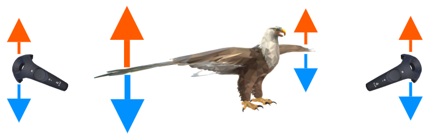
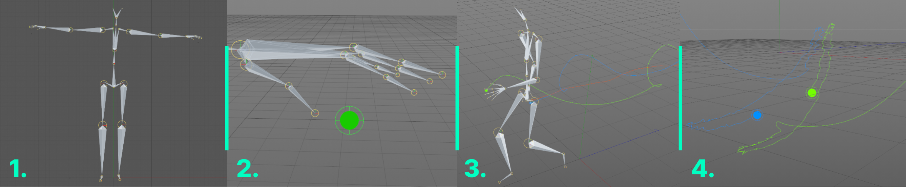
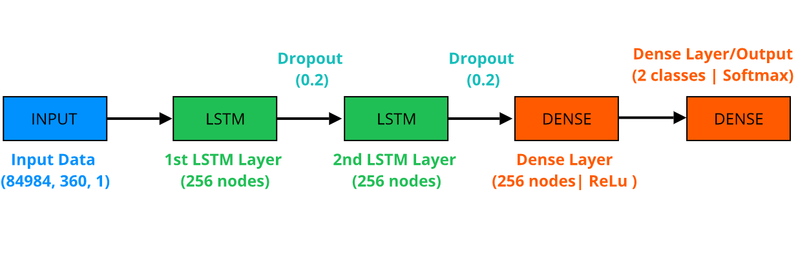
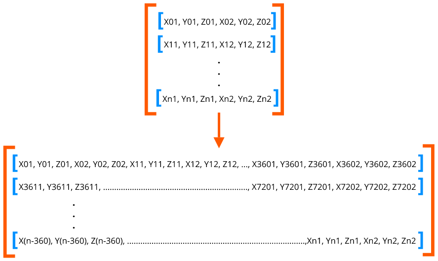
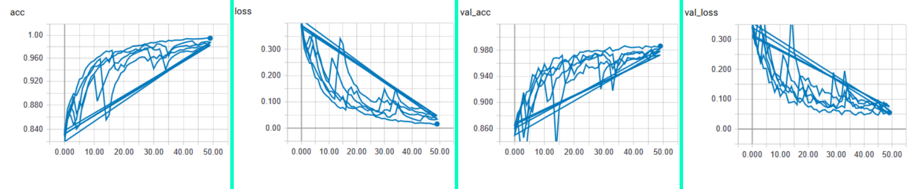

# Gesture-Recognition; Character Control; Machine Learning; VirtualReality; Real-Time; User-Defined; 

This project presents the work towards developing Gesture-Based Character Control, a gesture-recognition, and control system that allows users to record custom gestures using the Virtual Reality controllers and use it to control a character’s corresponding actions in real time. Firstly, a neural network is trained offline on an open Mocap database to distinguish between gestures and idle actions that the user may perform in real time. Then, during runtime, the neural network is tuned to improve detecting gestures each time the user performs them. In this report, we present the first phase of the project. The offline training of the system to efficiently distinguish between gestures and idle action.
The outcome of our work is a network classifier with 98.7% accuracy.

## Data preparation

First, we select mocap data from [CMU](http://mocap.cs.cmu.edu/motcat.php). We pick various motions that fit best for our two classes of "idle" and "gesture". We extract the motion of hands from the full body motion by tracking a point at a fixed distance from the palm. Then subtract the root motion from the hands motion to fix it at origin.

Steps shown from left to right:
1. Example animation file, human armature, at frame 0 (T-Pose)
2. Hand motion tracking point (green sphere)
3. Example of hand motion extraction for both hands (green and blue splines)
4. Hand trackers' motion after root motion is removed

## Data augmentation

There aren't enough motion files in the database of choice to sufficiently train for both classes of "idle" and "gesture". So we augment our own dataset from the select few of motions for each class. We do this by introducing perturbations to the motion resulting from step 4 from the previous section. This is done by introducing a random noise of a small range to the location and rotations of the hand trackers at each frame.

## Training

To train our A.I. to distinguish the user's motion between idle and gestures, we architect an LSTM Recurent Neural Network (RNN), a high level graph shown below details the structure.

### Temporal component

Since the nature of gestures is temporal, we format the animation training data to include time. 
Initially, the data is composed of 6 coordinates (3 location coordinates x_i, y_i, z_i for each hand) at each frame i. 
The data is captured at 120 FPS, we opt to include 0.5 second of animation to feed the network each batch. 

## Results

The training metrics are shown below.

Overall, the resulting network successfully classifies the VR user's hand motions as either idle or gestures in realtime with an accuracy of 98.7%. 